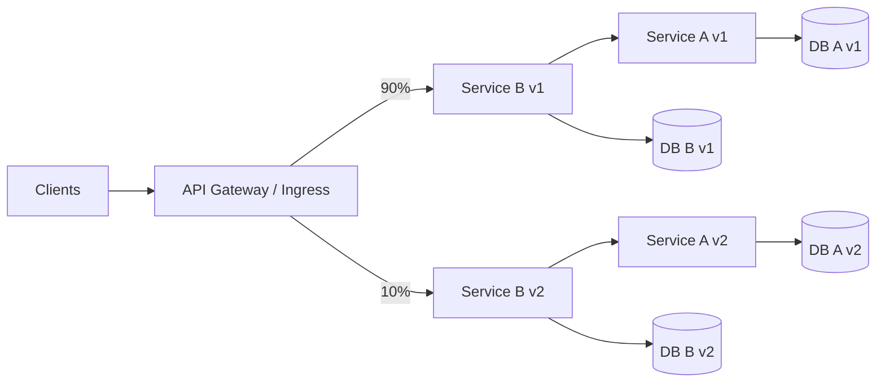
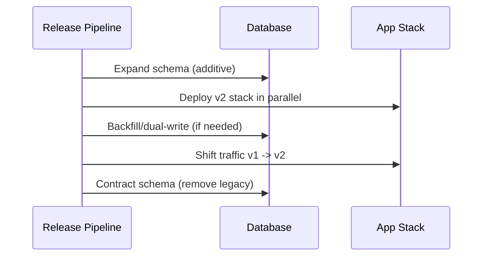

# Interview Questions & Answers: Paired-Service Zero/Low-Downtime Upgrades

This guide provides interview-ready questions and model answers for scenarios where:

- Service **B depends on A**
- A and B must remain on the **same version**
- Each service owns its own DB/cache
- Upgrades must be low-downtime and safe

---

## 1) Why can’t we do independent rolling updates for A and B here?

**Answer:**
Because protocol compatibility is strict. If `B(v1)` calls `A(v2)` (or vice versa), requests may fail due to contract drift. Independent rolling updates create mixed-version windows. Instead, treat `A+B` as one logical release unit and roll out whole stacks.

---

## 2) What deployment pattern is best for this constraint?

**Answer:**
Use **Blue/Green (parallel stacks)** at the stack level:

- Blue: `A(v1)+B(v1)`
- Green: `A(v2)+B(v2)`

Then shift ingress/gateway traffic from Blue to Green progressively (canary) or atomically.

### Diagram: Parallel stacks and traffic shift

---

## 3) How do you guarantee B always talks to matching A version?

**Answer:**
Use versioned service discovery and overlays:

- `component-a-v1` for `component-b-v1`
- `component-a-v2` for `component-b-v2`

In Kustomize overlays, patch `COMPONENT_A_BASE_URL` per version so runtime calls cannot cross version boundaries.

---

## 4) What is the safest database migration strategy?

**Answer:**
Prefer **expand → migrate/backfill → contract**:

1. Expand schema in a backward-compatible way
2. Backfill/migrate data
3. Shift traffic
4. Remove old fields later

If compatibility is impossible, run parallel schemas and cut over with rollback window.

### Diagram: Expand/contract sequence

---

## 5) How do you handle mobile clients during upgrade?

**Answer:**
Use one or both:

- **Header/version-based routing**: route app version 1 clients to v1 stack, v2 clients to v2 stack.
- **Minimum supported version gate**: if strict incompatibility exists, force update when retiring old stack.

---

## 6) What rollback approach do you use?

**Answer:**
Keep Blue live during the soak period. Rollback is a traffic flip back to Blue, not redeployment. This is faster and safer than rebuilding old pods during incident response.

---

## 7) What Kubernetes resources are key here?

**Answer:**
- `Deployment` and `Service` for A/B
- Kustomize `overlays/v1`, `overlays/v2`
- Ingress (or service mesh VirtualService) for weighted/header routing
- Readiness probes to prevent traffic to unready pods

---

## 8) What are good SRE checks before promoting canary weight?

**Answer:**
- 5xx rate, p95/p99 latency
- saturation (CPU/memory), restart count
- business SLIs (login success, checkout success, etc.)
- error budget burn rate

Advance weights only if all checks stay within thresholds.

---

## 9) How would you explain this design in one sentence in an interview?

**Answer:**
“Because A and B are strictly version-coupled, I deploy and route them as a single versioned unit using parallel stacks and controlled traffic cutover, with DB migration and rollback designed around no mixed-version runtime paths.”

---

## 10) What anti-patterns should be avoided?

**Answer:**
- Independent rolling upgrade of A then B
- Destructive DB changes before cutover
- No rollback window
- No contract testing between A and B

---

## Quick 60-second whiteboard narrative

1. Draw two stacks: v1 and v2, each with A->B->DBs.
2. Draw gateway sending 90/10 traffic.
3. Explain version-pinned internal calls (`Bv2->Av2`).
4. Explain DB expand/backfill/contract.
5. Explain rollback as route flip.
